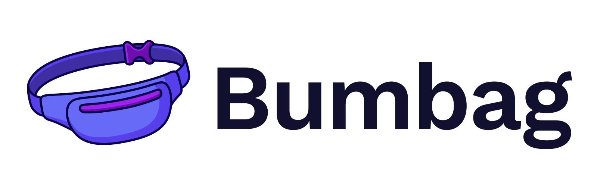

</img>

</img>

    </img>

    <a href="https://opencollective.com/bumbag">Become a sponsor!</a>

## Getting started

[Visit the Bumbag docs](https://bumbag.style) to get started with Bumbag.

## Join our community

[Join our discord server](https://discord.com/invite/BPnwqvJ) to get the latest updates, chat with other Bumbag enthusiasts, and see what's happening in the community!

## Contributing

Feel like contributing? That's awesome! We have a [Contributing guide](/CONTRIBUTING.md) to help you out
