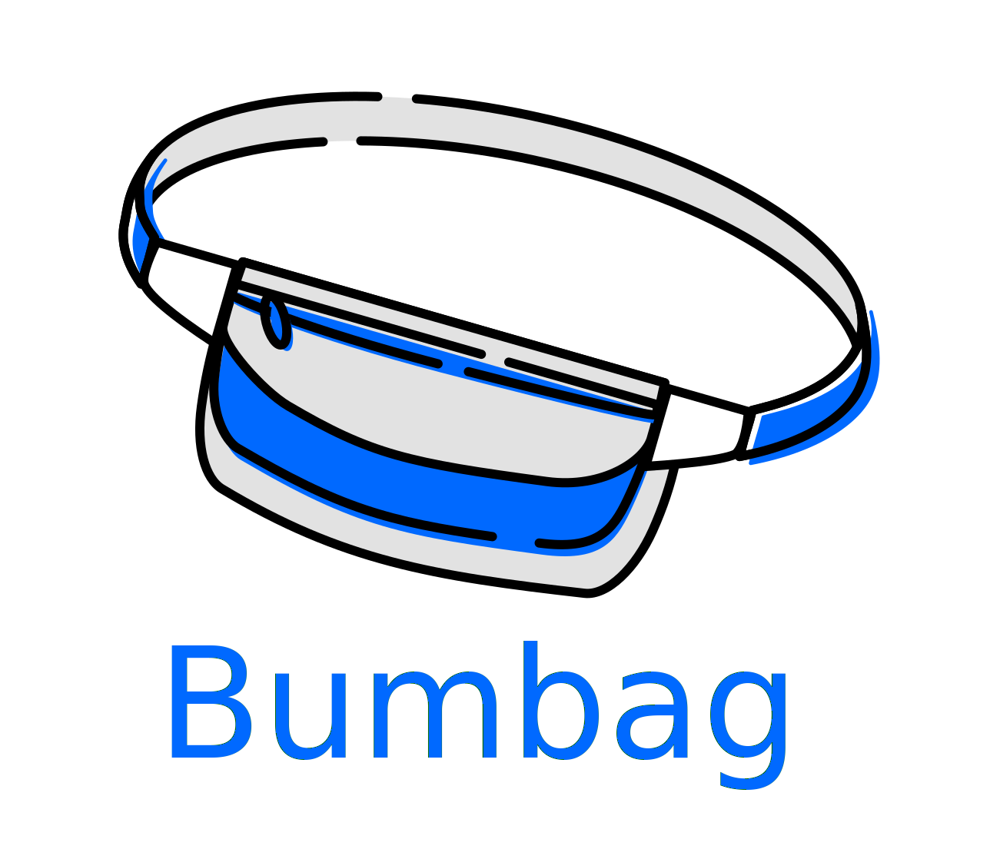

# Bumbag

<p align="center"></img></p>

> Note: Bumbag is still work in progress, meaning that it's APIs will most likely change in the future until a stable 1.0.0 release.

## Installing Bumbag

Run the following command to install **Bumbag**:

```curl
yarn bumbag
```

## Getting set up

To start using the components, please follow these steps:

1. Wrap your application in a `<ThemeProvider>` which is provided by **Bumbag**:

```jsx
import { ThemeProvider } from 'bumbag';

const App = () => (
  <ThemeProvider>
    // ... your app
  </ThemeProvider>
);
```

2. Now you can start using components like so!:

```jsx
import { Button } from 'bumbag';

const MyApp = () => (
  <Button>
    Hello world!
  </Button>
);
```
